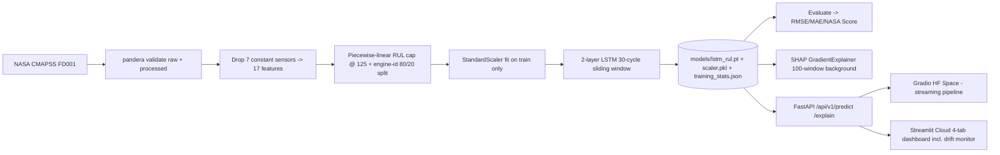

<div align="center">

# Before It Breaks

### Remaining Useful Life forecasting for industrial turbofan engines

*Catch engine failure **before** it happens — by reading the last 30 cycles of sensor data, not a single snapshot.*

[](https://huggingface.co/spaces/Priyrajsinh/before-it-breaks-engine-health)
[](https://before-it-breaks.streamlit.app/)

[](https://github.com/Priyrajsinh/before-it-breaks/actions/workflows/ci.yml)
[](LICENSE)
[](https://www.python.org/downloads/release/python-3120/)
[](https://pytorch.org/)
[](https://github.com/psf/black)

**Repository:** https://github.com/Priyrajsinh/before-it-breaks

</div>

---

## What it does

Industrial engines don't fail without warning — their sensor signals drift, creep, and wobble for dozens of cycles before anything breaks. **Before It Breaks** reads those signals and predicts how many operational cycles an engine has left (its *Remaining Useful Life*), so a maintenance team can act before a failure on the runway, in the turbine hall, or on the production line.

It learns the **shape of degradation over time** — a 2-layer LSTM watches a rolling 30-cycle window of 17 sensor and operational signals and forecasts the cycles-to-failure. For every prediction it also answers the question a real maintenance engineer asks next — *"which sensor is the warning signal?"* — and translates the whole thing into one plain-English sentence. No jargon in the output; just **"Engine 68 will reach end-of-life in about 6 cycles — schedule maintenance immediately."**

Trained and validated on **NASA's CMAPSS FD001** benchmark, the industry-standard dataset for prognostics research.

---

## Live demos

| Demo | What you'll see | Link |
|------|-----------------|------|
| 🤗 **Gradio Space** | Streaming "Engine Health Monitor" — pick one of 100 unseen test engines and watch the pipeline animate: window → preprocess → LSTM → SHAP → plain-English recommendation. | **[Open the Space ↗](https://huggingface.co/spaces/Priyrajsinh/before-it-breaks-engine-health)** |
| 📊 **Streamlit Cloud** | 4-tab dashboard: **Engine Health · Sensor Analysis (SHAP) · Drift Monitoring (per-sensor PSI) · How It Works**. | **[Open the dashboard ↗](https://before-it-breaks.streamlit.app/)** |
| 🧪 **Swagger / OpenAPI** | Interactive REST docs for the FastAPI service (`/predict`, `/explain`, `/metrics`). | `make serve` → http://localhost:8000/docs |

> **Try it:** in the Gradio Space, select **engine 68** → *6 cycles remaining, CRITICAL*. In Streamlit, select **engine 1** → *99 cycles, HEALTHY*. Both are unseen NASA test engines.

---

## Quick start

Requires **Python 3.12**. The project ships a `Makefile` that wraps the whole lifecycle:

```bash
make install      # venv deps + pre-commit hooks
make train        # fit the 2-layer LSTM → models/lstm_rul.pt + scaler.pkl + training_stats.json
make evaluate     # RMSE / MAE / NASA Score + SHAP figures → reports/
make serve        # FastAPI at http://localhost:8000/docs
make streamlit    # 4-tab dashboard at http://localhost:8501
make gradio       # streaming Engine Health Monitor at http://localhost:7860
make audit        # pip-audit (CVEs) + detect-secrets + bandit
make ci           # the full gate suite — identical to .github/workflows/ci.yml
```

---

## Architecture



**Inference pipeline order** (defence-in-depth — every input is validated before it reaches the model):
`Pydantic validate → pandera schema → check_skew() drift flags → safe_predict() NaN/inf/shape guard → LSTM forward → optional SHAP → NL translate`.

---

## Headline test results

Measured on the **official CMAPSS FD001 test set** (100 held-out engines, one ground-truth RUL each) — see [`reports/results.json`](reports/results.json).

| Metric | Value | How to read it |
|--------|-------|----------------|
| **RMSE** | **15.79 cycles** | Root-mean-squared error. Comparable to published LSTM baselines on FD001 (e.g. Zheng et al. 2017 reported **16.14**). |
| **MAE** | **11.06 cycles** | Mean absolute error — the typical miss is ~11 cycles. |
| **NASA Score** | **673.5** | The official CMAPSS asymmetric score — lower is better; late predictions are penalised harder than early ones. |
| **Test engines** | **100** | Every engine in the canonical FD001 test set. |

A **coverage-regression test** (rule C37) fails CI if test-set RMSE ever drifts above **30 cycles** — the model can't silently rot.

> **Health bands** (cycles remaining): **Healthy ≥ 80 · Warning 40–79 · Critical < 40.**

---

## Why these design decisions? (the pedagogy)

This repo is built around three sacred modelling rules. Each one is a deliberate, defensible choice — exactly the kind a reviewer or interviewer will probe.

### 1. Why piecewise-linear RUL labelling? *(rule C35)*

A naive label is `RUL = max_cycle − current_cycle`. But that says a brand-new, perfectly healthy engine at cycle 5 has an RUL of 195 — a precise number the sensors give **no signal** for. During the long, flat *healthy* phase, every engine looks identical; only later does degradation actually become measurable.

If you train on raw RUL, the model wastes most of its capacity trying to fit those meaningless large numbers and is graded on un-learnable targets. The fix (Zheng et al. 2017) is a **piecewise-linear label capped at `max_rul = 125`**: every cycle with raw RUL > 125 is clipped to 125. The model now focuses its capacity on the **degradation phase**, where predictions actually matter and the sensors actually carry signal. 125 is the most common cap in the FD001 literature.

### 2. Why split by engine ID, not by row? *(rule C33)*

The single most common mistake in CMAPSS papers is a **random row split**. Each engine is a *time series* — if you shuffle rows, cycle 50 of engine 12 lands in training while cycle 51 of engine 12 lands in validation. The model "validates" on an engine whose recent history it has already memorised. That's **temporal leakage**, and it inflates scores into fantasy.

We split **by `engine_id`**: engines **1–80 train**, engines **81–100 validate**. No engine appears on both sides. Validation measures what we actually care about — generalisation to an engine the model has *never seen*. The official FD001 test set (a separate 100 engines) is the final, untouched judge.

### 3. Why SHAP `GradientExplainer`, not `TreeExplainer`? *(rule C50)*

SHAP has different explainers for different model families. **`TreeExplainer` is exact — but only for tree ensembles** (XGBoost, random forests). An LSTM is a differentiable deep network, so it needs **`GradientExplainer`**, which estimates attributions by integrating input-gradients against a **background dataset** (the baseline the explanation is measured *against*).

- **Background:** 100 random training windows — `torch.Tensor[100, 30, 17]`. The baseline is "a typical engine," so attributions read as "how much does *this* engine differ from normal."
- **Output:** SHAP returns `[1, 30, 17]` (one value per timestep per feature). We take the **mean absolute value over the 30-timestep axis** → a single per-feature importance vector of length 17. That collapses "when did it matter" into "*which sensor* matters," which is the question a maintenance engineer asks.

---

## Drift monitoring *(rule C42)*

A model is only as trustworthy as the data it's fed in production. The service computes a **Population Stability Index (PSI)** per sensor, comparing each incoming window against the training distribution stored in `training_stats.json`.

- **PSI > 0.2** → the input distribution has shifted meaningfully → increment the Prometheus `sensor_drift_total` counter **and** emit a structured-log warning.
- The Streamlit **Drift Monitoring** tab visualises per-sensor PSI against the 0.2 alarm line, so a covariate shift between the simulator and a real fleet is *visible*, not silent.

---

## EU AI Act framing

> This system falls under **Annex III §2 (Critical infrastructure — management and operation of critical infrastructure)** when deployed in aviation, energy, or transport contexts, and under **Annex III §4 (Employment, workers management and access to self-employment)** when its outputs inform maintenance-worker scheduling. Both categories are **high-risk** under the regulation, requiring documented training-data lineage (**pandera** schemas + **DVC** + **SHA-256** sidecars in this repo), risk management (the **drift monitor** + **coverage-regression CI gate**), and human oversight (the natural-language output is **informational, not autonomous** — a human schedules the maintenance).

This isn't decoration: the repo carries the audit trail a high-risk classification demands — schema validation on raw *and* processed data, version-pinned data with checksums, a runtime drift alarm, a CI gate that blocks regressions, and recommendations a person acts on rather than a system that acts alone.

---

## Interview talking points

The five questions this project is designed to answer crisply:

1. **Why piecewise-linear RUL?** *"Raw RUL is noisy in the healthy phase — every engine looks the same early on. Capping at 125 focuses the model's capacity on the degradation phase where predictions actually matter. It's been standard since Zheng et al. 2017."*

2. **Why a 2-layer LSTM?** *"A feedforward network treats each cycle independently. My LSTM reads the last 30 cycles as a sequence and learns temporal degradation patterns — gradual pressure drops, rising variance — that no single snapshot can reveal."*

3. **Why `GradientExplainer`, not `TreeExplainer`?** *"`TreeExplainer` is exact for tree ensembles. For a differentiable model like an LSTM you need `GradientExplainer`, which integrates input-gradients against a background dataset. I pass 100 random training windows as the background; the `[1, 30, 17]` output is averaged over the sequence axis to get per-feature importance."*

4. **How did you prevent data leakage?** *"I split by engine ID, not by row. A random row split leaks future cycles of training engines into validation — the model 'validates' on history it has already seen. Engines 1–80 train, 81–100 validate, and the official FD001 test set is the final judge."*

5. **EU AI Act compliance?** *"Annex III §2 (critical infrastructure) and §4 (employment, workers management) — both high-risk. My repo has the audit trail: pandera schemas on raw + processed data, DVC + SHA-256 for data lineage, a drift monitor (PSI > 0.2 alarms), a coverage-regression CI gate, and human-readable output instead of autonomous decisions."*

---

## REST API

The FastAPI service (`make serve` → http://localhost:8000/docs) exposes:

| Method & path | Purpose |
|---------------|---------|
| `POST /api/v1/predict` | RUL + health status + NL summary + drift flags (rate-limited 60/min) |
| `POST /api/v1/predict_batch` | Up to 50 windows in one call |
| `POST /api/v1/explain/{engine_id}` | Per-sensor SHAP importance + top warning features |
| `GET /api/v1/engines` | The pre-loaded test-engine IDs |
| `GET /api/v1/health` | Liveness, model-loaded, uptime, version, prediction count |
| `GET /api/v1/model_info` | Contents of `reports/results.json` |
| `GET /metrics` | Prometheus exposition (`sensor_drift_total`, `predictions_served_total`, `rul_prediction_gauge`, `inference_latency_seconds`) |

`PredictRequest` carries `sensor_window` of shape **`[30, 17]`**, validated by Pydantic → pandera → `safe_predict()` before it reaches the model. Errors flow through a typed exception hierarchy to a FastAPI **422** handler.

---

## Project structure

```
before-it-breaks/
├── src/
│   ├── api/app.py               # FastAPI service (predict / explain / metrics)
│   ├── dashboard/streamlit_app.py  # 4-tab Streamlit Cloud dashboard
│   ├── data/                    # dataset.py, schemas.py (pandera), validation,
│   │                            # skew_check (drift), safe_predict (NaN/shape guard)
│   ├── model/                   # lstm.py, base.py (ABC), train.py, evaluate.py, predict.py
│   ├── explainability/          # shap_explainer.py (GradientExplainer)
│   ├── monitoring/              # Prometheus metrics + PSI drift
│   ├── exceptions.py            # typed error hierarchy → FastAPI 422
│   └── logger.py                # structured JSON logging
├── hf_space/app.py              # self-contained Gradio Space (no src/ imports — rule C12)
├── research-notes/              # 5-entry reading log (Saxena/Zheng/Malhotra/Li/Wu)
├── tests/                       # one test per src/ file; coverage gate 70%
├── config/config.yaml           # all hyperparameters + thresholds (no hardcoded knobs)
├── data/raw/*.sha256            # checksummed, DVC-tracked CMAPSS files (raw not committed)
├── reports/results.json         # headline metrics + per-engine predictions
├── models/                      # lstm_rul.pt (state_dict) + scaler.pkl + training_stats.json
├── MODEL_CARD.md                # model card + EU AI Act + BibTeX citations
├── Dockerfile                   # single-stage, non-root, py3.12-slim
└── Makefile                     # install / train / evaluate / serve / streamlit / gradio / ci
```

---

## Dataset

**NASA CMAPSS FD001** (Saxena & Goebel, 2008) — 100 train + 100 test turbofan engines, each run from healthy to failure under a single operating condition and fault mode (HPC degradation). Each cycle records 3 operational settings + 21 sensors. We drop **7 near-constant sensors** (sensor 1, 5, 6, 10, 16, 18, 19) that carry no degradation signal (rule C40), leaving **17 features**. The raw files are **never committed** — they're DVC-tracked with SHA-256 sidecars at `data/raw/*.sha256` (rule C41).

---

## Citations

1. **Saxena, A., & Goebel, K. (2008).** *Turbofan Engine Degradation Simulation Data Set (C-MAPSS).* NASA Ames Prognostics Data Repository.
2. **Zheng, S., Ristovski, K., Farahat, A., & Gupta, C. (2017).** *Long Short-Term Memory Network for Remaining Useful Life Estimation.* IEEE Int'l Conf. on Prognostics and Health Management (ICPHM).
3. **Malhotra, P., Ramakrishnan, A., Anand, G., Vig, L., Agarwal, P., & Shroff, G. (2016).** *LSTM-Based Encoder-Decoder for Multi-Sensor Anomaly Detection.* ICML Anomaly Detection Workshop.
4. **Li, X., Ding, Q., & Sun, J.-Q. (2018).** *Remaining Useful Life Estimation in Prognostics Using Deep Convolution Neural Networks.* Reliability Engineering & System Safety, 172, 1–11.
5. **Wu, J., et al. (2020).** *Feature Selection for Remaining Useful Life Prediction.* (CMAPSS sensor-selection study.)

Full BibTeX in [`MODEL_CARD.md`](MODEL_CARD.md); per-paper reading notes in [`research-notes/`](research-notes/).

---

## License

Released under the [MIT License](LICENSE) — © 2026 Priyrajsinh Parmar.

## Built by

**Priyrajsinh Parmar** · [github.com/Priyrajsinh](https://github.com/Priyrajsinh)

> Predictive maintenance the way a maintenance engineer thinks about it: *temporal degradation patterns and early warning* — not point-in-time classification.
